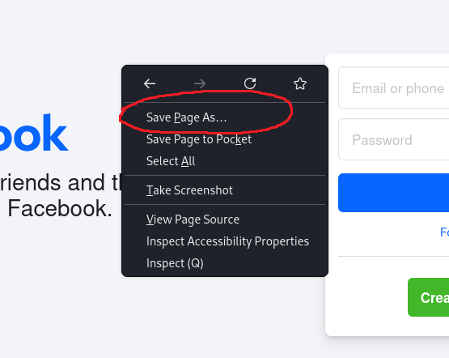
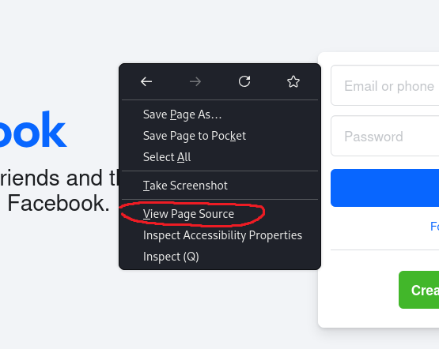
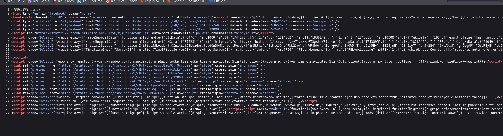
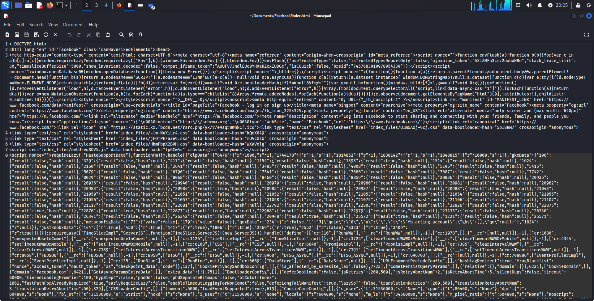
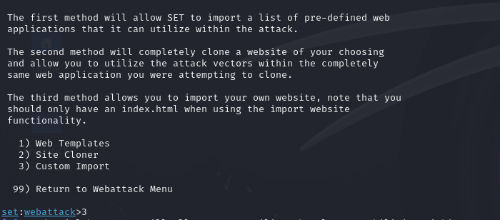
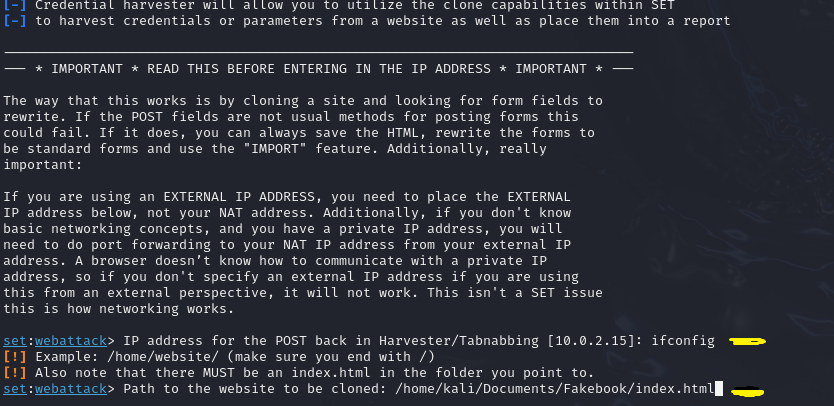
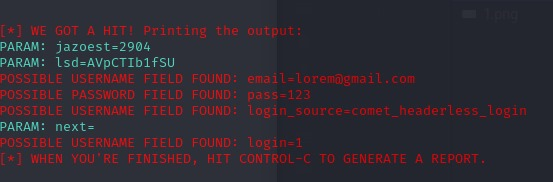

# Phishing para captura de senhas do Facebook

### Ferramentas

- Kali Linux
- setoolkit

### Configurando o Phishing no Kali Linux

- Acesso root: ``` sudo su ```
- Iniciando o setoolkit: ``` setoolkit ```
- Tipo de ataque: ``` Social-Engineering Attacks ```
- Vetor de ataque: ``` Web Site Attack Vectors ```
- Método de ataque: ```Credential Harvester Attack Method ```
- Método de ataque: ``` Site Cloner ```
- Obtendo o endereço da máquina: ``` ifconfig ```
- URL para clone: http://www.facebook.com

## Resutados


### Executando Exercício

#### Problema encontrado
- Felizmente (para a segurança do site) o Facebook possui uma tecnologia que impede esse tipo de clonagem, fazendo com que as senhas e e-mails sejam criptografadas.

#### Solução
Depois de ver o que seria possível fazer para burlar essa criptografia, foi feito o seguinte:

- Depois que entrei no site, salvei o template como "index.html".



- Também foi necessário entrar no "View Page Source".



- No "View Page Source" eu copiei todo o código que estava na página.



- No arquivo index que salvei, abri ele como bloco de notas e colei o código que havia copiado.



- Então pesquisei no bloco de notas a palavra "Button" até encontrar o botão de login com um ID, então apaguei esse ID e salvei o arquivo.

### Usando o Setoolkit

- Em vez de selecionar a opção de clonar um site, eu escolhi a opção 3 "Custom Import".



- Coloquei onde estava localizado o arquivo 'index.html'.



- Foi necessário tambem o url do site do facebook.

- Então foi criado a copia.

## Resultado
